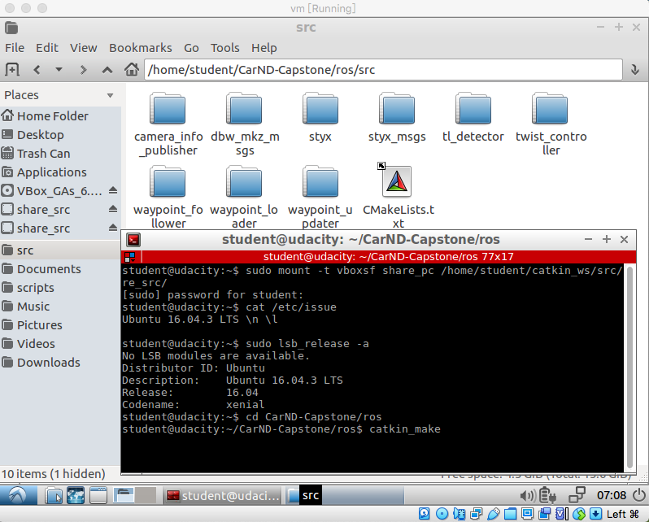
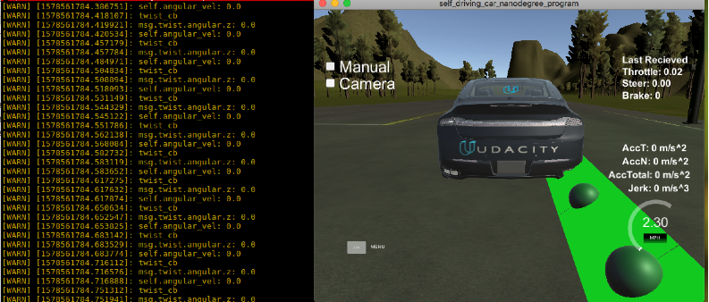
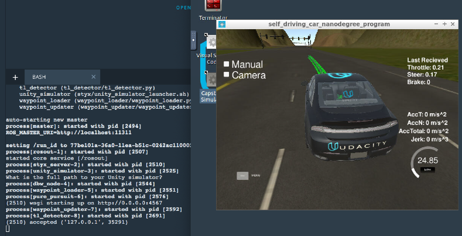
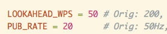
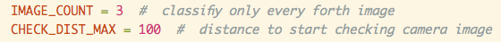
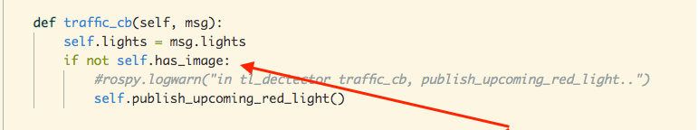
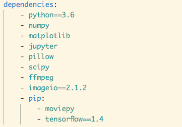
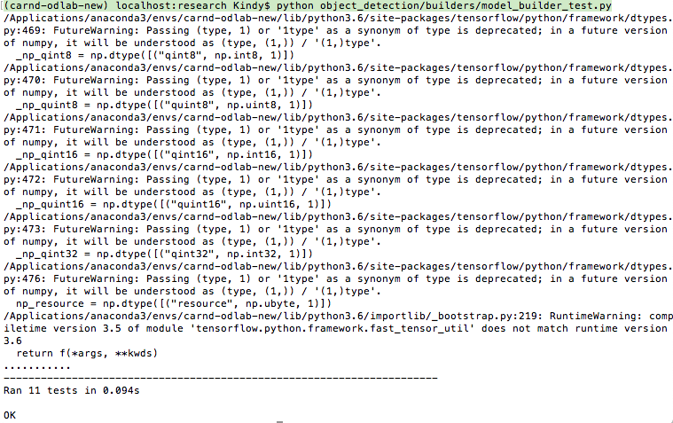
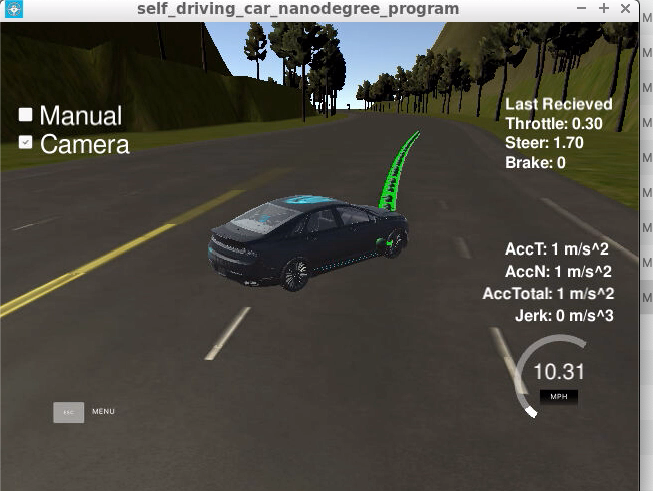
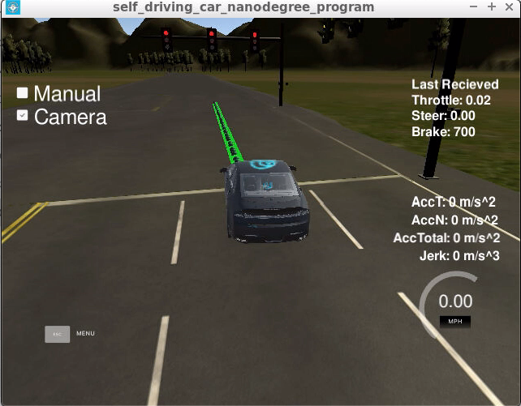

# CarND-Programming a Real Self-Driving Car
Project Team:  
Team Lead:   Mian Huang   kindht@qq.com  
Team Member: Rami Ejleh   rami.ejleh1@gmail.com


# Overview
This is the final project of the Udacity Self-Driving Car Engineer Nanodegree: a system integration project utilizing Robot Operating System (ROS). 

### Goals
In this project, the goal is to build the software for the entire self-driving car end-to-end both in simulator and on a physical car - the Udacity Carla. 

The car should drive around the test track using waypoint navigation and stop at red traffic lights

### The project directory structure :
```
CarND-Capstone
|___data
|___imgs
|   README.md
|   requirements.txt
|___ros
    |___launch
    |___src
        |___camera_info_publisher
        |   CMakeLists.txt
        |___dbw_mkz_msgs
        |___styx
        |___styx_msgs
        |___tl_detector
        |___twist_controller
        |___waypoint_follower
        |___waypoint_loader
        |___waypoint_updater
Test_object_dection
```

**Note**: In the directory of **Test_object_dection**, there is one jupyter notebook `tl_classification_Test.ipynb` , only used for testing frozen graph inferences.

# Environment Setup
The project requires the use of **Ubuntu Linux** (the operating system of **Carla**) and a **simulator**.

Tremendous time was spent on environment setup. It was time consuming due to Operating System specific problems and performance related problems.

## Coding and initial test environment setup on MacOS Mojave (10.14.5)
In order to develop code on MacOS Mojave,  the following steps were taken:
1) Download the compressed VM disk image - Udacity provided [here](https://s3-us-west-1.amazonaws.com/udacity-selfdrivingcar/Udacity_VM_Base_V1.0.0.zip)

- The VM image is **Ubuntu Linux 16.04 with ROS Kinetic** installed, as well as Dataspeed DBW installed already.
- This is a large download about 5.5GBs!  

2) Download **VirtualBox** [here](https://www.virtualbox.org/wiki/Downloads)
3) Import VM image to VirtualBox 
4) Setup hared folder for VM and host(tricky things here, ex. extension packages needed)
5) Download **simulator** [here](https://github.com/udacity/CarND-Capstone/releases)

The interface within the VM is like this:  


For more details on Ubuntu and ROS installation:  
- Udacity project instructions [here](https://github.com/udacity/CarND-Capstone)  
- Port Forwarding instructions [here](https://s3-us-west-1.amazonaws.com/udacity-selfdrivingcar/files/Port+Forwarding.pdf)

## Objection Detection environment setup
This is used for traffic light detection, we will discuss later in the implementation of "light_classification"


# Running the code
Make sure that the environment has Ubuntu Linux and ROS installed correctly as above, start from project root directory:
```bash
cd CarND-Capstone
cd ros
catkin_make
source devel/setup.sh
roslaunch launch/styx.launch
```
Above are for running with simulator, if running with real site:  
Use `roslaunch launch/site.launch`

## Initial test
Initial test is done by running project code **within the VM** while running the simulator natively in the host machine using port forwarding on port 4567. 

Due to the low performance with the VM and local machine, the initial test can only help ensure the code run without obvious errors, it is a way to **quick check** on code logic and some variables' values.

## Final test 
The Udacity project workspace is installed with Ubuntu linux and ROS already, but GPU time is limited , so only **final test** is done in **the workspace with GPU enabled** after the code can run through initial test. 

For example, when the car could run forward in initial test in simulator, but the waypoints were lagging behind the car, and the car would drive out of the track after a while, these would tell us that the code is most likely working but the performance is too bad with the VM, we have to use more powerful system.

When trying to **run the code in workspace**,  following steps are needed:
1. Delete the code files/folders to be updated in workspace
2. Upload the updated code files/folders from local machine where the code is developed
3. Run the command in one terminal of workspace to make sure python files executable:  
`find /home/workspace/CarND-Capstone/ros/src -type f -iname "*.py" -exec chmod +x {} \;`
4. **Enable GPU mode** - ROS only available when GPU enabled!
5. Running the code (as stated above)
6. Go to desktop in workspace and start simulator there

## Training on AWS
Model training is done on AWS: 

Our team ended up using **SSD Inception V2 Coco (17/11/2017)** because it has good results for its performance. The Pros are: Very fast, Cons: Not good at generalization on different data.

We had to re-configure the model as follows:
1. Changed ``num_classes: 90`` to the number of labels in our ``label_map.pbtxt``. This is ``num_classes: 4``
2. Set the default ``max_detections_per_class: 100`` and ``max_total_detections: 300`` values to a lower ``max_detections_per_class: 10`` and ``max_total_detections: 10``
4. Changes ``fine_tune_checkpoint: "PATH_TO_BE_CONFIGURED/model.ckpt"`` to the directory where our downloaded model is stored e.g.: ``fine_tune_checkpoint: "models/your_tensorflow_model/model.ckpt"``
5. Set ``num_steps: 200000`` down to ``num_steps: 20000`` (num_steps:10000 for simulator model)
6. Change the ``PATH_TO_BE_CONFIGURED`` placeholders in ``input_path`` and ``label_map_path`` to our .record file(s) and ``label_map.pbtxt``
7. Configured a few things like batch size and dropout as well

To set up the AWS instance we did the following:
1. [Login to our Amazon AWS Account][aws login]
2. Navigate to ``EC2`` -> ``Instances`` -> ``Spot Requests`` -> ``Request Spot Instances``
3. Under ``AMI`` clicked on ``Search for AMI``, type ``udacity-carnd-advanced-deep-learning`` in the search field, choose ``Community AMIs`` from the drop-down and selected the AMI (**This AMI is only available in US Regions so make sure you request a spot instance from there!**)
4. Clicked on ``Change instance type`` and selected the ``p2.xlarge`` instance
5. Selected our key pair under ``Key pair name``
6. Under ``Additional Configurations``. Unchecked the ``Delete`` checkbox under ``EBS Volumes`` so our progress is not deleted when the instance get's terminated
7. Under ``Additional Configurations``, Set ``Security Groups`` to ``default``
8. Next ``Fleet request settings``, unchecked the ``Apply recommendations`` and removed all instance types other than ``p2.xlarge``
9. Clicked ``Launch``, waited until the instance is created and then connect to our instance via ssh

We trained two models, one on simulator data and one on real site data. Each trainig session took around 13 hours to train.  
Finally, we exported both models as a frozen inference graph.

# System Architecture
The following is a system architecture diagram(provided by Udacity) showing the **ROS nodes and topics** used in the project:


ROS nodes were written for core functionality of the autonomous vehicle system, including traffic light detection, control, and waypoint following.

# Implementation
The project was implemented in the order as Udactiy suggested following the project walkthrough:

### **Step 1. Waypoint Updater Node (Partial)**:
Completed a partial waypoint updater which subscribes to **/base_waypoints** and **/current_pose** and publishes to **/final_waypoints**.

The code is in `(path_to_project_repo)/ros/src/waypoint_updater/waypoint_updater.py`.  

The code is able to:
- receive base waypoints and the current position of the car
- figure out the closest waypoint ahead of the car
- generate a lane, i.e. a fixed number of waypoints (LOOKAHEAD_WPS) ahead of the car
- finally publish the lane for car to follow 

### **Step 2. DBW Node**:  
 Once the waypoint updater is publishing **/final_waypoints**, the **waypoint_follower** (Autoware software) node will start publishing messages to the **/twist_cmd** topic. Then the DBW node will take the messages.
 
 This part of the code is in `(path_to_project_repo)/ros/src/twist_controller`.  

The goal for this part is to:
 - implement the **drive-by-wire** node (`dbw_node.py`) which subscribes to **/twist_cmd**, **/vehicle/dbw_enabled**, **/current_velocity** and uses various controllers to provide appropriate throttle, brake, and steering commands
 - implement the `Controller` class (`twist_controller.py`) , where a **control** method is implemented to take twist data as input and return **throttle, brake, and steering** values. This class utilized Udacity provided pid.py and lowpass.py for throttle and acceleration control, `yaw_controller.py` for steering control.

**Important to know**:  
- line 86 in dbw_node.py:  
 `rate = rospy.Rate(50) # must be 50Hz`  
  The DBW system on Carla expects messages at the frequency of 50Hz, if rates are lower , safety feature on the car will return control to the driver
- line 67 in twist_controller.py  
  `brake = 700  # N*m `
   Because that the Carla has an automatic transmission, to prevent Carla from moving requires about 700 Nm of torque

After this part of development was done, as mentioned earlier, with the code running **in the VM**, the car would always run away from the track, that is due to the **latency**, waypoints are even lagged behind the car:  




So finally the test must be done in the **workspace with GPU enabled** (or other powerful machine), the car could drive following the waypoitns in the simulator, while ignoring the traffic lights:  


**Notes**:  
in `waypoint_updater.py`  


The reduced numbers of LOOKAHEAD_WPS and PUB_RATE are for reducing the impacts of the latency betwen the ROS code and the simulator.


### **Step 3. Traffic Light Detection**:  
Once the car is able to process waypoints,generate steering and throttle commands, and traverse the track, it will need stop for obstacles. Here we just focused on Traffic lights.

The code is in `(path_to_project_repo)/ros/src/tl_detector/`:  
-`tl_detector.py`  
-`light_classification/tl_classifier.py`

The code completed the following:
#### 1. Detection: Detect the traffic light  
In the `process_traffic_lights` method of `tl_detector.py`:   

Use the car's location (from topic **/current_pose**) and the (x, y) coordinates for traffic lights' stoplines(imported from the `traffic_light_config` file) to find the nearest visible traffic light ahead of the car

After getting the upcoming traffic light position, the light status is determined in 2 ways:
1. Utilize the topic **/vehicle/traffic_lights** which contains status of all traffic lights in simulator, so first step just implemented `get_light_state` method in `tl_detector.py` by returning `light.state`.  

2. Use the camera image data (**/image_color**) to classify the color of the traffic light.  We trained a deep learning classifier to classify the entire image as containing either a red light, yellow light, green light, or no light. The training used Tensorflow Objection Detection API, setup details will be discussed in  **Object Detection-Traffic Light Classification**
   
   Note:  when **'Camera' mode** is checked, the car will experience the latency problems, so it is better to limit the traffic light classification only within a certain distance from the upcoming light, and only classify every forth image.  
   
   

#### 2. Waypoint publishing: 
With identified the traffic light status and its position, The traffic light detection node (`tl_detector.py`) will publish the postion(index) of the waypoint for nearest **upcoming red light's stopline** to a single topic **/traffic_waypoint**.

Notes: When utilizing **/vehicle/traffic_lights**  to determine light status, the waypoint publishing is done in `traffic_cb` method, so that we don't need turn on 'Camera' mode in simulator to avoid performance issues.


### **Step 4. Waypoint Updater (Full)**: 
Use the waypoint index from **/traffic_waypoint** to change the waypoint target velocities before publishing to /**final_waypoints**. 

The code is updated in `(path_to_project_repo)/ros/src/waypoint_updater/waypoint_updater.py`.

The goal is to adjust the target velocities for the waypoints leading up to red traffic lights in order to bring the car to a smooth and full stop.  
At this point,  the car can stop at red traffic lights and move when they are green, by utilizing `light.state` in simulator.  


Now our task left is to implement **traffic light classification using camera images**.

# Object Detection - Traffic Light Classification
The traffic light classification is to detect the traffic light color from the messages of topic **/image_color**, the messages are actually camera images.

In order to obtain an **image classifier**, transfer learning was in consideration, but how to train new models with new dataset for object detection is the key problem. 

Alex's work on [Traffic Light Classification](https://github.com/alex-lechner/Traffic-Light-Classification#4-training-the-model) helped us a lot. The basic idea is to leverage **Tensorflow Object Detection API**. It turned out that we actually don't need write any code for training and exporting new models with new data, but it is a bit confusing and very time consuming for environment setup and configurations for the first time user.

## **Environment Setup**

### 1. Environment setup for Udacity [Objection Detection Lab](https://github.com/udacity/CarND-Object-Detection-Lab)    

Ideally one command should work after downloading environment.yml(env_cn.yml):  
`conda env create -f environment.yml`

When it didn't work, the workaround is to create a new environment using Anaconda in GUI directly with python 3.6, then install packages one by one using pip in command line, for example:  
`pip install imageio==2.1.2`

Note for MacOS user:  
ffmpeg should be installed by 
using:  `brew install ffmepg`

**Make sure all of the following  in environment.yml  are installed**:  


tensorflow-gpu==1.4 shall be installed if GPU is available.

### 2. Environment setup for [Tensorflow Object Detection API](https://github.com/tensorflow/models/tree/master/research/object_detection)

In order to use the API, we followed the installation guide [here](https://github.com/tensorflow/models/blob/master/research/object_detection/g3doc/installation.md), but workarounds are needed when some commands don't work. Most of time they are machine specific problems.


#### 0. Installation of Dependencies
Since we already have the lab environment, we only need to install
the additional libraries like the following:

```
brew install protobuf
pip intall --user Cython
pip install --user contextlib2
pip install lxml
```
Notice when working on MacOS,  brew is used to install protobuf, "sudo apt-get" does not work.


#### 1. Download the API (following [Alex's](https://github.com/alex-lechner/Traffic-Light-Classification/blob/master/README.md) instructions)

1. Ceate a new directory somewhere and name it `tensorflow`
2. Clone TensorFlow's models repository from the tensorflow directory by executing

      ```
      git clone https://github.com/tensorflow/models.git
      ```
3. Navigate to the models directory in the Command Prompt and execute
    ```
    git checkout f7e99c0
    ```
    This is important because the code from the master branch won't work with TensorFlow version 1.4. Also, this commit has already fixed broken models from previous commits.


#### 2. Protobuf Compilation 
For MacOS, we are already done this by `brew install protobuf`, if not on MacOS, need run following:

```
# From tensorflow/models/research/
protoc object_detection/protos/*.proto --python_out=.
```

#### 3. Add Libraries to PYTHONPATH
```
# From tensorflow/models/research/
export PYTHONPATH=$PYTHONPATH:`pwd`:`pwd`/slim
```

#### 4. Testing installation
```
python object_detection/builders/model_builder_test.py
```


# **Training Models**
Considering the efficienty and performance, **ssd_inception_v2_coco_2017_11_17** was chosen as pretrained model to train our models for object detection , config files are updated [here](./ros/src/tl_detector/light_classification/config). 

We leveraged [Alex's data](https://github.com/alex-lechner/Traffic-Light-Classification#4-training-the-model) and trained our models on AWS, one for simulator , one for real site.

# **Test Results on Individual Image**
Use our frozen graphs to predict traffic light in individual iamge, test results in jupyter notebook [here](./Test_object_dection/tl_classification_Test.ipynb).

## Simulator Graph [Result](./Test_object_dection/tl_classification_Test_Final_sim.html)
Model trained **`10000`** steps  
If a light is detected, the score can be up to 99%, the lowest score can also be over 70%

## Real Site Graph [Result](./Test_object_dection/tl_classification_Test_Final_site.html)
Model trained **`20000`** steps  
If a light is detected, most of scores can be over 90% and up to 99%. 


# **Test in Simulator** 
## Without Camera
The car can **run well**, **stop** at each red light perfectly, and **continue** to run till a loop of the track.


## With Camera
When using image classificaitons, there are some **latency** issues,  the car might not stop perfectly at each red light, it may pass some light even if trying to slow down, or it may run aside from the right track, but **please wait a while**, it could **find its way back** and continue to finish a loop anyway.

Find its way back:


One **good case** for stopping at red light


# **Test in Real Site**
Not test yet, hope it can run well on Carla!


